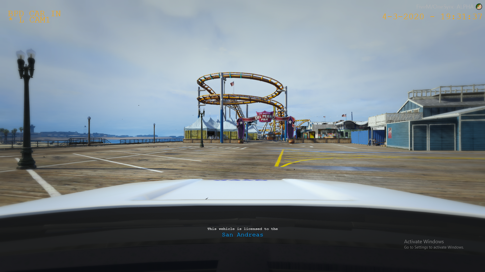

# FiveM Dashcam
> A FiveM server-sided script that allows a dashcam view for police vehicles

Images:

## Installation

Windows:

1. Download it
2. Extract it to your resources folder
3. Add it to server cfg
4. Done

## Controls

Press C to enter

(!DISCLAIMER! This is a modified version of github.com/xander1998 dashcam)